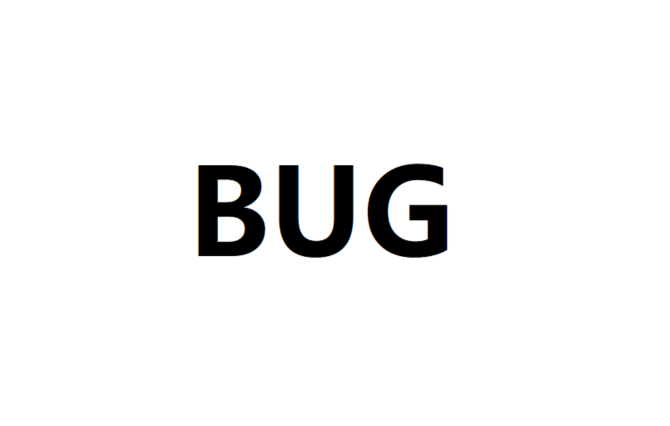

<p>
    <samp>
        <strong>
            You cannot improve your past, but you can improve your future. Once time is wasted, life is wasted..			</strong>
    </samp>
</p>


## Hi there 👋 I'm lzhpo.

<p align="left">
    I'm a full-stack developer.I like playing basketball and coding and often active on some technology platforms to learn good things.
</p>


<div>
    <a href="https://github.com/lzhpo">
        
    </a>
    <a href="mailto:lzhpo1024@gmail.com">
        
    </a>
    <a href="https://t.me/lzhpo">
        
    </a>
    <br/>
    
    
    
</div>


<details>
    <summary>
        <b>More about me</b>
    </summary>





<h3 align="center">Languages</h3>
<p align="center">
    
    
    
</p>


```go
var lzhpo = &map[string]interface{}{
	"monthOfBirth": "1999-07",
	"email":        "lzhpo1024@gmail.com",
	"blog":         "www.lzhpo.com",
	"hobby":        []string{"Basketball", "Coding", "Music"},
	"languages":    []string{"Java", "Go", "JS"},
	"technologyStack": map[string]interface{}{
		"frontend": "Vue",
		"mobile": map[string]interface{}{
			"android": []string{
				"okHttp",
				"retrofit2",
				"rxjava",
			},
		},
		"backend": map[string]interface{}{
			"databases": []string{"MySQL", "Redis"},
			"framework": map[string]interface{}{
				"java": map[string]interface{}{
					"webDev": []string{
						"Spring",
						"SpringMVC",
						"SpringBoot",
						"Mybatis",
						"JPA",
					},
					"microservice": []string{
						"Eureka",
						"Consul",
						"SpringCloud Ribbon",
						"SpringCloud Feign",
						"SpringCloud Hystrix",
						"SpringCloud Config",
						"SpringCloud Gateway",
						"SpringCloud Sleuth",
						"SpringCloud Zipkin",
					},
					"messageQueues": []string{"RabbitMQ", "Pulsar"},
					"searchEngine":  []string{"Elasticsearch", "Logstash", "Kibana"},
					"devops":        []string{"Docker", "Nginx", "Git", "Maven", "Gradle"},
				},
				"go": []string{
					"gorm",
					"gin",
					"go-chi",
					"gqlgen",
					"sarama",
					"viper",
					"validator",
					"amqp",
				},
			},
		},
		"bigdata": []string{
			"Hadoop",
			"HBase",
			"Hive",
			"Spark",
			"Flink",
			"Sqoop",
			"Flume",
			"Drill",
			"Zookeeper",
		},
		"editors": []string{"IDEA", "Goland", "WebStorm"},
	},
}
```
